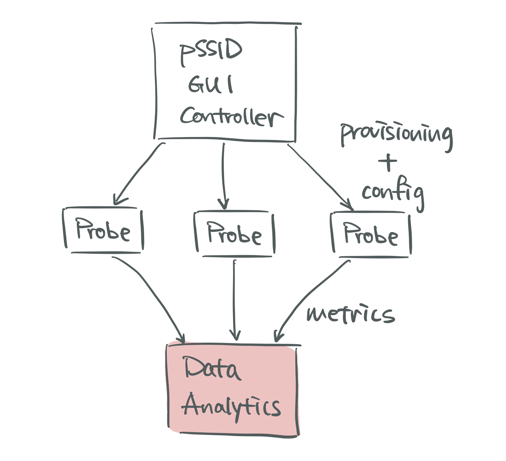
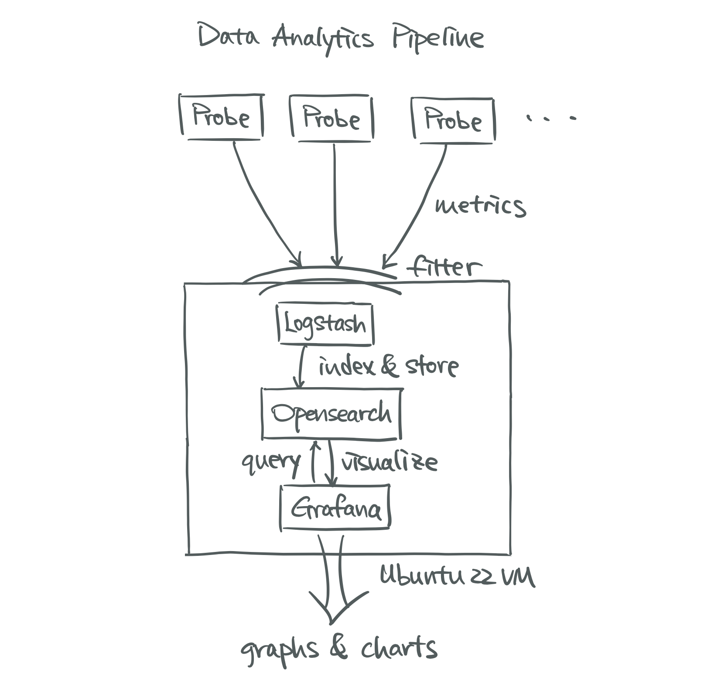
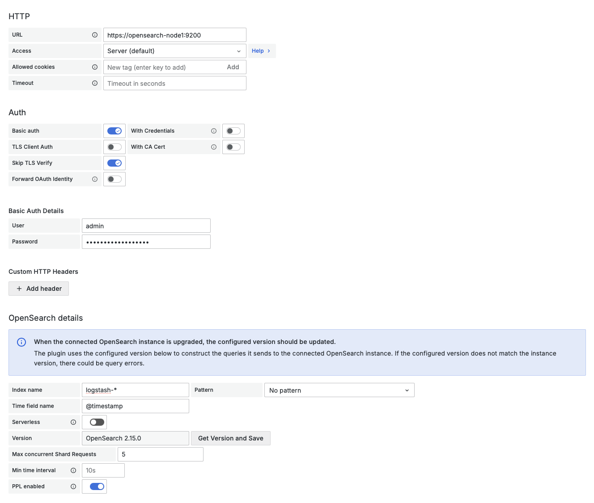

# pSSID Data Analytics Pipeline

A data analytics pipeline for pSSID that receives, stores, and visualizes WiFi test metrics gathered by Raspberry Pi WiFi probes.

<p align="center">
</img>
</img>
</p>

**Left image:** Overview of the entire pSSID architecture with the data analytics pipeline highlighted. The pipeline receives test results (metrics) from probes, stores them, and provides visualization.

**Right image:** Architecture of the pipeline itself, leveraging the ELK stack concept with `Opensearch` replacing `Elasticsearch` and `Grafana` replacing `Kibana`.

## 📋 Requirements

- Ubuntu 22 virtual machine
- Docker and Docker Compose installed

### Installing Docker (if needed)
Reference the [official Docker install documentation](https://docs.docker.com/engine/install/ubuntu/) and follow their steps to install Docker Engine.

Verify your Docker installation:
```bash
sudo docker run hello-world
```
You might need to start Docker (this will also make it automatically run on system boot):
```bash
sudo systemctl enable --now docker
```

## 🚀 Installation

### Step 1: Clone the Repository
Clone this repository to your host machine. Each service has its own `docker-compose` file for better modularization, so when you scale, you could simply provision more nodes
without touching other components of the pipeline. 

### Step 2: Configure OpenSearch Security
OpenSearch requires passwords since version 2.12.0. Set up environment variables by adding these lines to your `.bashrc` file (this documentation uses `admin` as the username and `OpensearchInit2024` as the password for demonstration),
`nano ~/.bashrc`.
```bash
export OPENSEARCH_HOST=https://opensearch-node1:9200
export OPENSEARCH_INITIAL_ADMIN_PASSWORD=OpensearchInit2024
export OPENSEARCH_USER=admin
export OPENSEARCH_PASSWORD=OpensearchInit2024
```

> ⚠️ **Note:** These variable names are used by `opensearch-one-node.yml` and `logstash.yml`. You can freely change their values, but do not edit names unless for a good reason.

Then reload the environment variables:
```bash
source ~/.bashrc
```

### Step 3: Configure Docker Permissions
Add your user to the docker group to avoid using `sudo` (since the root user cannot read the environment variables defined by non-root users):
```bash
sudo usermod -aG docker ${USER} && newgrp docker
```
Ensure that Docker is working without root:
```bash
docker run hello-world
```
> ⚠️ **Important:** Running with `sudo` prevents access to user environment variables.

### Step 4: Set System Requirements
OpenSearch requires `vm.max_map_count` of at least 262144.

Check current value:
```bash
sysctl vm.max_map_count
```

If it's too low, edit `/etc/sysctl.conf` as sudo and add:
```
vm.max_map_count=262144
```

Apply changes:
```bash
sudo sysctl -p
```

### Step 5: Configure Logstash
1. Use the provided logstash.conf in the `logstash-pipeline` directory of this repository as a starting point. You can revise this file later to meet your testing needs.
2. Edit `logstash.yml` (from the root of the cloned repo) to mount your pipeline directory:

```yaml
# TODO: mount your pipeline directory into the container. USE ABSOLUTE PATH!
# abs path example: /home/uniqname/pssid-data-pipeline/logstash-pipeline
- <ABS_PATH_TO_YOUR_PIPELINE_DIRECTORY>:/usr/share/logstash/pipeline
```

### Step 6: (Optional) Configure Grafana Authentication and Alerting
> 💡 **Tip:** To disable SSO or email alerting, comment out variables starting with `GF_AUTH_` or `GF_SMTP_` in `grafana.yml`
> > ⚠️ **Important:** Even if you skip this step, be sure to edit `GF_SERVER_ROOT_URL=https://<PIPELINE-HOSTNAME>`


#### Google SSO Setup
1. **Register with Google:** Follow [Grafana's Google Authentication guide](https://grafana.com/docs/grafana/latest/setup-grafana/configure-security/configure-authentication/google/)
2. **Create `.env` file** in the same directory as `grafana.yml` with:
   ```env
   GOOGLE_CLIENT_ID=your-google-client-id
   GOOGLE_CLIENT_SECRET=your-google-client-secret
   ```
   
#### Email Alerting (SMTP)
1. Configure following [Grafana's email alert documentation](https://grafana.com/docs/grafana/latest/alerting/configure-notifications/manage-contact-points/integrations/configure-email/)
2. For Gmail, see [Google's app password guide](https://support.google.com/mail/answer/185833?hl=en)
3. Add SMTP credentials to `.env` file
   
> ⚠️ **Note:** If using version control, please use the `.env` file method and add `.env` to your `.gitignore`! Github doesn't allow pushing commits that contain secrets.

### Step 7: (Optional) Configure Grafana HTTPs using nginx and Certbot
> 💡 **Tip:** To disable Grafana HTTPs, remove the nginx and certbot sections under `services` in the cloned `grafana.yml`, and remove `nginx-html` and `certbot-etc` under `volumes`.


Before you start, open nginx/conf.d/grafana.conf and make the following edits:
```conf
server_name <YOUR-PIPELINE-HOSTNAME-HERE>;
```
Then, open `nginx/conf.d/grafana.conf.https` and make the following edits:
```conf
server_name <YOUR-PIPELINE-HOSTNAME-HERE>;
...
server_name <YOUR-PIPELINE-HOSTNAME-HERE>;
ssl_certificate     /etc/letsencrypt/live/<YOUR-PIPELINE-HOSTNAME-HERE>/fullchain.pem;
ssl_certificate_key /etc/letsencrypt/live/<YOUR-PIPELINE-HOSTNAME-HERE>/privkey.pem;
```

If this is your *first* time running grafana.yml, run this command to create the network:
```bash
# From your cloned repository's directory:
docker network create pssid-data-pipeline_opensearch-net
```

After that, you can run nginx:
```bash
# From your cloned repository's directory:
docker compose -f grafana.yml up -d nginx
```
Then run certbot to generate certificates:
```bash
# From your cloned repository's directory:
docker compose -f grafana.yml run --rm --entrypoint="" certbot \
  certbot certonly --webroot -w /var/www/certbot \
           -d <PIPELINE-HOSTNAME> \
           --email YOUR-UNIQNAME@umich.edu --agree-tos --no-eff-email
```

If you're getting the error `Certbot failed to authenticate some domains (authenticator: webroot)`, use `docker ps` to check that your nginx container is running without errors. You can troubleshoot using `docker logs -f <nginx-container-id>`.

After successfully running the command above, rename the `grafana.conf` file to `grafana.conf.old` and rename `grafana.conf.https` to `grafana.conf`.
```bash
# From your cloned repository's directory:
mv nginx/conf.d/grafana.conf nginx/conf.d/grafana.conf.old
mv nginx/conf.d/grafana.conf.https nginx/conf.d/grafana.conf
```

Then run:
```bash
# From your cloned repository's directory:
docker exec <nginx-container-name> wget -O /etc/letsencrypt/options-ssl-nginx.conf https://raw.githubusercontent.com/certbot/certbot/master/certbot-nginx/certbot_nginx/_internal/tls_configs/options-ssl-nginx.conf
docker exec <nginx-container-name> wget -O /etc/letsencrypt/ssl-dhparams.pem https://raw.githubusercontent.com/certbot/certbot/master/certbot/certbot/ssl-dhparams.pem
```
> 💡 **Tip:** To check what your nginx container name is, try running `docker ps | grep nginx`, it'll be the last item listed in the row.

Verify that the certificate and key files are in the right place:
```bash
docker exec -it pssid-data-pipeline-nginx-1 \
       ls -l /etc/letsencrypt/live/<PIPELINE-HOSTNAME>
```
If that returns a list of .pem files, go ahead and test the nginx config:
```bash
# From your cloned repository's directory:
docker exec <nginx-container-name> nginx -t
```
If you see `nginx: configuration file /etc/nginx/nginx.conf test is successful`, then run:
```bash
# From your cloned repository's directory:
docker exec <nginx-container-name> nginx -s reload
```

Use curl to test HTTPS access:
```bash
# From your cloned repository's directory:
curl -I https://<PIPELINE-HOSTNAME>
```
Or navigate to `https://<PIPELINE-HOSTNAME>` in a web browser and it should redirect you to Grafana's login page.

### Step 8: Start the Services
> 💡 **Before running grafana:** If this is your *first* time running grafana.yml (having skipped the HTTPS setup step), then create the network before running Grafana:
```bash
# From your cloned repository's directory:
docker network create pssid-data-pipeline_opensearch-net
```
> Also, give Grafana permission to access your plugins directory:
```bash
# From your cloned repository's directory:
# Set ownership to the Grafana user (UID 472)
sudo chown -R 472:472 ./plugins
# Set appropriate permissions
sudo chmod -R 755 ./plugins
```
Bring up OpenSearch, Logstash, and Grafana:
```bash
# From your cloned repository's directory:
docker compose -f opensearch-one-node.yml up -d
docker compose -f logstash.yml up -d

# Run this if you had set up SMTP or SSO for Grafana:
docker compose -f grafana.yml --env-file .env up -d

# Otherwise, run this:
docker compose -f grafana.yml up -d
```

(Optional) Start OpenSearch Dashboard:
```bash
docker compose -f opensearch-dashboard.yml up -d
```

> 💡 **For debugging:** To check Logstash output, run this command after starting the logstash service:
```bash
docker logs -f logstash
```

> 💡 **Common Error:** When restarting the Grafana container, you might occasionally see `KeyError: 'Container Config'`. To resolve this issue, use `docker ps` and then run `docker rm -f <container-id>` for each container in the list. After starting Grafana, rerun all the commands above to start the services again.

## 🔌 Default Ports

| Service | Port | Purpose |
|---------|------|---------|
| Logstash | 9400 | Filebeat input |
| OpenSearch | 9200 | Logstash input |
| Grafana | 3000 | Web dashboard |
| Nginx | 80 | HTTP (ACME challenges + HTTPS redirects) |
| Nginx | 443 | HTTPS (secure web dashboard) |
| OpenSearch Dashboard | 5601 | Web dashboard (optional) |

> 🔥 **Firewall:**
> - **If with HTTPS:** Ensure ports 80, 443, 9400, and 5601 are open for external traffic
> - **If without HTTPS:** Ensure ports 9400, 3000, and 5601 are open for external traffic
> - **Note:** Port 9200 is for internal container communication only

## 📖 Usage Guide

### Filebeat Configuration
Use the [Ansible playbook](https://github.com/UMNET-perfSONAR/ansible-playbook-filebeat) to install Filebeat on probes. Ensure SSH access from your Ansible control node to all target probes in inventory/hosts.ini

For configuration changes:
1. Clone the [Ansible role](https://github.com/UMNET-perfSONAR/ansible-role-filebeat) into the playbook directory
2. Edit `defaults/main.yml`:
```yaml
# add your pipeline hostname under this list variable
# you can add multiple hosts
filebeat_output_logstash_hosts:
  - "<PIPELINE-HOSTNAME>:9400"
```

### Logstash Configuration (`logstash.conf`)
Contains input sources, custom filters, and output destinations. Most customization happens in the `filter` section.

Ruby parsing scripts sourced from [perfSONAR logstash repository](https://github.com/perfsonar/logstash/tree/master/perfsonar-logstash/perfsonar-logstash).

### OpenSearch Dashboard
Access at `<pipeline-hostname>:5601`
- Default credentials: `admin` / `OpensearchInit2024` (as defined in env variables above)
- Use Dev Tools to inspect indices and output: `GET <index-name>/_search`
- Use Dev Tools to delete indices from old probes that are no longer sending data: `DELETE pscheduler_*_<probe-name>_*` (this command may need to be adjusted if you change the index naming scheme specified in the output field of Logstash)
- Use this [Index State Management](https://docs.opensearch.org/latest/im-plugin/ism/index/) guide to configure policies that manage your indices (for example, creating a policy to delete an index that hasn't been updated for a few days)
  
### Grafana Setup

#### Access Dashboard
- **If HTTPs configured**: Navigate to `https://<pipeline-hostname>/`
- **If HTTPS not configured**: Navigate to `<pipeline-hostname>:3000`
- Default credentials: `admin` / `admin`
- Google SSO available for view-only access (if configured)

#### Add OpenSearch Data Source
1. Navigate to **Connections → Data Sources → Add New Data Source**
1. Select OpenSearch from available sources
2. Configure as shown:

</img>

**Configuration details:**
- **URL:** Use `https://opensearch-node1:9200` (Docker hostname)
- **Auth:** Enable `Basic auth` and `Skip TLS Verify`
- **Credentials:** Use your OpenSearch username/password (default credentials: `admin` / `OpensearchInit2024` as defined in env variables above)
- **Index:** Use wildcards (e.g., `pscheduler_*`)

To list available indices:
```bash
# From your cloned repository's directory:
curl -u <OPENSEARCH_USER>:<OPENSEARCH_PASSWORD> --insecure \
    "https://localhost:9200/_cat/indices?v"
```
Or you can use Dev Tools on OpenSearch Dashboard to check. This repository's provided logstash.conf has all indices configured with a `pscheduler_*` index pattern.

#### Import Dashboard
1. Navigate to **Dashboards → New → Import**
2. Drag and drop JSON file from `exported-grafana-json` folder

## 📊 Creating Visualizations
After configuring data sources, you can create custom visualization panels and dashboards using Grafana's query builder with your OpenSearch indices.
> ⚠️ **Note:** After each time you restart Grafana on Docker, you may have to manually refresh each panel by clicking 'Edit' and then 'Refresh'; the mass-refresh button on Grafana seemingly only works after this first manual refresh.
